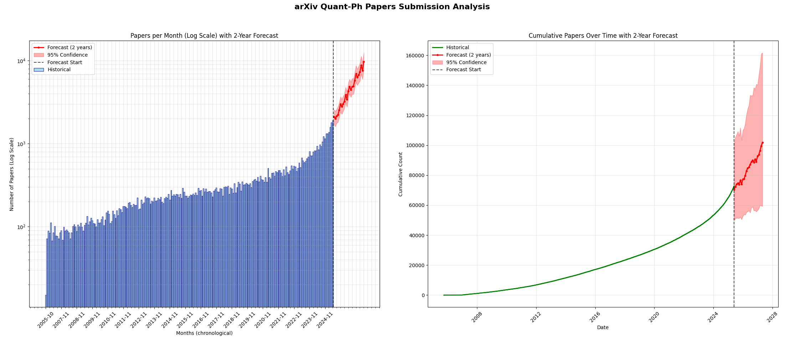
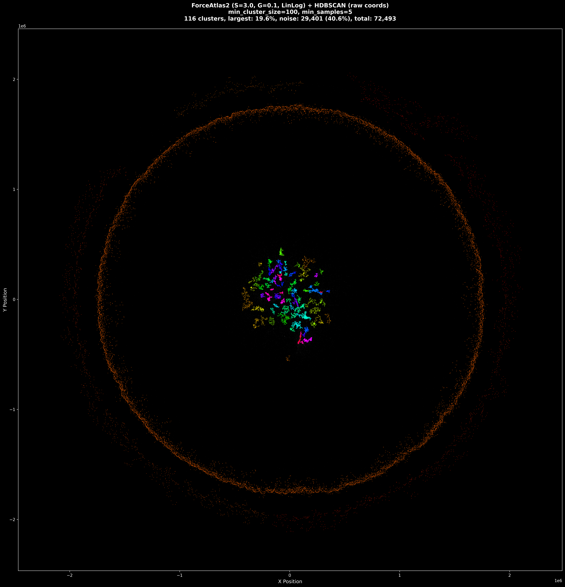
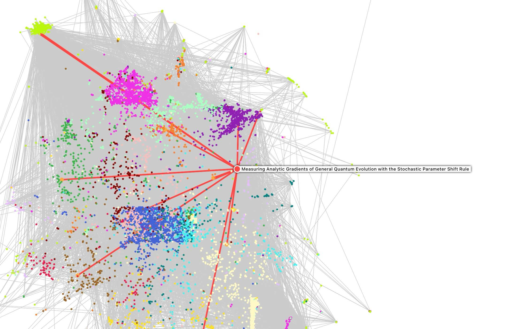

# 🧬 Quantum Physics Papers: Citation Network Analysis & Interactive Visualization

### 1. Automatcially download the arxiv id of 70k+ quantum physics papers, then use semantic scholar batch download API to download 400k+ citation relations.

### 2. Use cuGraph ForceAtalas2 to arange and HDBSCAN for clustering

### 3. Use React + sigma.js + fastapi to interactively build a webinterface for exploring the citation graph. 
Decomposes the graph into DAG + additional cycle-forming edges.

### 4. RAG/MCP for LLM coming soon
