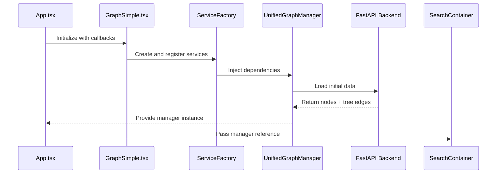
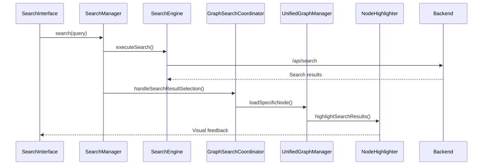
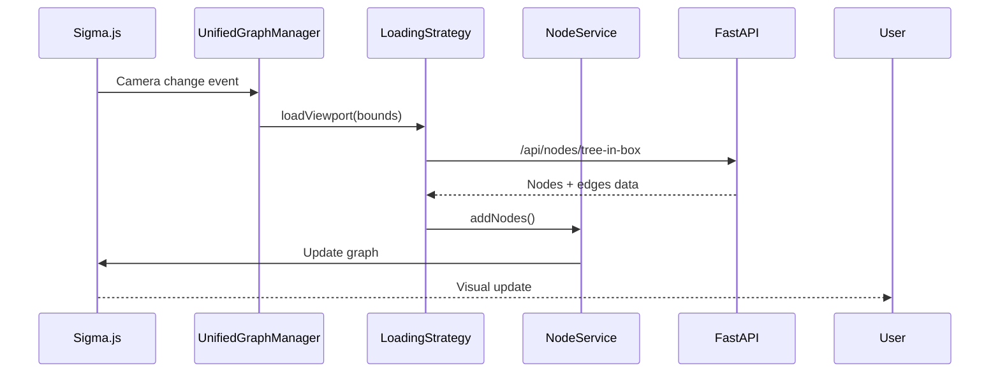

# 🌐 Current Stage Summary: Frontend Architecture Documentation

## 📋 Executive Summary

The `src/frontend` directory contains a sophisticated **sigma.js-based graph visualization** system for exploring citation networks. The architecture has evolved through multiple phases, resulting in **three distinct approaches**:

1. **Legacy GraphManager** (1,663 lines) - Original monolithic approach with LOD system
2. **TreeFirstGraphManager** (1,121 lines) - DAG-based approach with guaranteed connectivity  
3. **Unified Architecture** (Service-based) - Modern object-oriented approach with dependency injection

The system uses **React + TypeScript** for the UI, **FastAPI + SQLite** for the backend, and **sigma.js** for graph rendering with **WebGL acceleration**.

---

## 🏗️ Directory Structure Overview

```
src/frontend/
├── src/                           # Main TypeScript/React source
│   ├── components/               # React UI components
│   ├── utils/                   # Core business logic
│   │   ├── core/               # Modern OOP architecture (new)
│   │   ├── services/           # Service layer implementations  
│   │   ├── strategies/         # Strategy pattern implementations
│   │   ├── factories/          # Factory pattern for DI
│   │   ├── search/             # Search functionality
│   │   ├── clustering/         # Cluster management
│   │   ├── api/                # API client layer
│   │   └── [other utils]/      # Various utility modules
│   ├── api/                    # API interface definitions
│   └── hooks/                  # Custom React hooks
├── backend_fastapi.py           # Main FastAPI server (67 lines)
├── backend_tree_endpoints.py    # Tree-first API endpoints (694 lines)
├── config.yaml                 # Main configuration file
├── docs/                       # Architecture documentation
└── [build/deployment files]    # Package.json, tsconfig, etc.
```

---

## 🎯 Core Components Analysis

### **1. Main Application Entry Points**

#### **App.tsx** (60 lines)
**Purpose**: Root React component orchestrating the entire application

**Key Responsibilities**:
- **Graph Manager Initialization**: Creates and manages `UnifiedGraphManager` instance
- **Search Integration**: Handles keyboard shortcuts (Ctrl+K) for search
- **Panel Management**: Controls visibility of debug and search panels
- **Error Boundaries**: Wraps all components in error handling
- **Theme Integration**: Applies theme colors via `useTheme` hook

**Key Interfaces**:
```typescript
// State management
const [graphManager, setGraphManager] = useState<UnifiedGraphManager | null>(null);
const [searchVisible, setSearchVisible] = useState(false);

// Component interactions
<GraphSimple onGraphManagerInit={setGraphManager} />
<SearchContainer graphManager={graphManager} />
```

#### **main.tsx** (10 lines)
**Purpose**: React application bootstrap with StrictMode

---

### **2. Graph Visualization Components**

#### **Graph.tsx** (326 lines) - **COMPLEX LEGACY COMPONENT**
**Purpose**: Original comprehensive graph component with direct UnifiedGraphManager integration

**Key Features**:
- **Sigma.js Integration**: Full SigmaContainer setup with controls
- **WebGL Context Management**: Handles context loss/recovery
- **Node/Edge Reducers**: Custom rendering logic for clusters and LOD
- **Camera State Debugging**: Extensive logging for troubleshooting
- **Error Recovery**: Attempts to recover from WebGL failures

**Critical Code Sections**:
```typescript
// Node reducer for cluster colors and overlap handling
sigma.setSetting("nodeReducer", (node, data) => {
  const overlappingNodes = findOverlappingNodes(node, sigma);
  // Jitter logic for overlapping nodes
  // Cluster-based coloring
});

// Edge reducer for selective visibility
sigma.setSetting("edgeReducer", (edge, data) => {
  return {
    hidden: true, // Default hidden, shown on node selection
    size: data.isTreeEdge ? 0.67 : 0.33,
    color: data.isTreeEdge ? 'rgba(68, 68, 68, 0.7)' : 'rgba(102, 102, 102, 0.7)'
  };
});
```

**Interfaces**:
- **Input**: Graph manager initialization callback
- **Output**: Provides UnifiedGraphManager instance to parent
- **Dependencies**: ConfigLoader, ServiceFactory, ClusterManager

#### **GraphSimple.tsx** (243 lines) - **PREFERRED MODERN COMPONENT**
**Purpose**: Simplified graph component using the new architecture

**Key Features**:
- **Clean Service Integration**: Uses ServiceFactory for dependency injection
- **Event-Driven Stats**: Displays real-time loading statistics
- **Error Handling**: Comprehensive error boundaries with recovery
- **Minimal Configuration**: Focused on essential sigma.js settings

**Key Interfaces**:
```typescript
interface GraphSimpleProps {
  onSearchOpen: () => void;
  onGraphManagerInit: (manager: UnifiedGraphManager) => void;
}

// Event handling
manager.on('loading-started', () => setStats(prev => ({ ...prev, isLoading: true })));
manager.on('loading-completed', (data) => setStats({ ... }));
```

**Performance Features**:
- Loading indicators with progress tracking
- Stats overlay showing node/edge counts
- Automatic error recovery with reload option

---

### **3. User Interface Components**

#### **SearchContainer.tsx** (145 lines)
**Purpose**: Main search interface wrapper component

**Key Features**:
- **Modal-style Search**: Overlay interface with Esc/click-outside closing
- **Graph Manager Integration**: Direct communication with UnifiedGraphManager
- **Keyboard Shortcuts**: Ctrl+K to open, Esc to close
- **Responsive Design**: Adapts to screen size

**Interface**:
```typescript
interface SearchContainerProps {
  graphManager: UnifiedGraphManager | null;
  isVisible: boolean;
  onClose: () => void;
}
```

#### **SearchInterface.tsx** (312 lines) - **COMPLEX SEARCH COMPONENT**
**Purpose**: Comprehensive search functionality with autocomplete and filters

**Key Features**:
- **Real-time Search**: Debounced API calls with immediate feedback
- **Autocomplete**: Smart suggestions based on paper titles/authors
- **Advanced Filters**: Year range, citation count, venue filtering
- **Search History**: Persistent recent searches
- **Result Navigation**: Keyboard navigation with arrow keys

**Critical Methods**:
```typescript
// Debounced search with error handling
const debouncedSearch = useMemo(() => 
  debounce(async (query: string) => {
    const results = await searchApi.searchPapers(query);
    setResults(results);
  }, 300), []
);

// Result selection with graph highlighting
const handleResultSelect = async (result: SearchResult) => {
  await graphManager?.searchAndHighlight(result.nodeId);
  onResultSelect?.(result);
};
```

#### **ClusterPanel.tsx** (65 lines)
**Purpose**: Cluster visibility control panel

**Key Features**:
- **Cluster Toggle**: Enable/disable cluster visibility
- **Color Indicators**: Visual cluster identification
- **Statistics**: Node count per cluster

#### **ConsolidatedPanel.tsx** (162 lines)
**Purpose**: Multi-functional side panel with tabs

**Key Features**:
- **Tabbed Interface**: Search, clusters, debug info
- **Responsive Layout**: Adapts to viewport size
- **State Management**: Persistent tab selection

#### **DebugPanel.tsx** (267 lines)
**Purpose**: Developer debugging interface

**Key Features**:
- **Performance Metrics**: Loading times, memory usage
- **Graph Statistics**: Node/edge counts, viewport info
- **API Monitoring**: Request status and timing
- **Configuration Display**: Current config.yaml values

---

### **4. Core Business Logic - Graph Managers**

#### **GraphManager.ts** (1,663 lines) - **LEGACY MONOLITH**
**Purpose**: Original graph management system with sophisticated LOD and caching

**Key Systems**:

1. **LOD (Level of Detail) System**:
```typescript
// 6-level LOD based on camera zoom ratio
private calculateLOD(cameraRatio: number): number {
  if (cameraRatio <= 0.3) return 0; // Maximum detail
  if (cameraRatio <= 1.0) return 1; // High detail
  // ... up to level 5 (overview)
}
```

2. **Spatial Quadtree Indexing**:
```typescript
interface QuadTreeNode {
  bounds: ViewportBounds;
  nodeIds: Set<string>;
  children: QuadTreeNode[] | null;
  level: number;
}
```

3. **Viewport Caching**:
```typescript
interface LoadedRegion {
  bounds: ViewportBounds;
  timestamp: number;
  nodeCount: number;
  lodLevel: number;
  spatialHash: string;
}
```

4. **Node Priority Management**:
```typescript
interface NodeImportance {
  nodeId: string;
  degree: number;
  distanceFromCenter: number;
  importance: number;
  lodLevel: number;
}
```

**Key Methods**:
- `updateViewport()`: Main viewport loading logic with LOD
- `loadViewportNodesLOD()`: Batched loading with performance optimization
- `removeExcessNodes()`: Memory management with priority-based eviction
- `filterExistingNodesByCluster()`: Dynamic cluster filtering

**Problems with this approach**:
- **Monolithic**: Single class handling too many responsibilities
- **Complex State**: Difficult to test and debug
- **Tight Coupling**: Direct dependencies on many utility classes
- **Memory Leaks**: Complex cleanup logic spread throughout

#### **TreeFirstGraphManager.ts** (1,121 lines) - **DAG-BASED APPROACH**
**Purpose**: Implements tree-first architecture with guaranteed node connectivity

**Core Philosophy**:
> *Every loaded node is guaranteed to be connected via tree edges*

**Key Features**:

1. **Atomic Loading**: Nodes + tree edges loaded together
```typescript
interface LoaderData {
  nodes: Array<{ key: string; attributes: ExtendedNodeAttributes }>;
  treeEdges?: Array<{ source: string; target: string }>;
  hasMore: boolean;
}
```

2. **Progressive Enrichment**: Extra edges loaded on demand
```typescript
interface NodeState {
  hasTreeEdges: boolean;    // Always true after loading
  hasExtraEdges: boolean;   // True after enrichment
  enrichmentRequested: boolean;
  lodLevel: LODLevel;
}
```

3. **4-Tier LOD System**:
```typescript
type LODLevel = 'universe' | 'field' | 'topic' | 'paper';

private calculateLODLevel(): LODLevel {
  const ratio = this.sigma.getCamera().ratio;
  if (ratio <= 0.5) return 'paper';
  if (ratio <= 2.0) return 'topic';
  if (ratio <= 8.0) return 'field';
  return 'universe';
}
```

4. **Dwell-Time Enrichment**:
```typescript
private dwellTimer: ReturnType<typeof setTimeout> | null = null;
private readonly dwellDelay = 1000; // ms to wait before enriching

private resetDwellTimer(): void {
  if (this.dwellTimer) clearTimeout(this.dwellTimer);
  this.dwellTimer = setTimeout(() => this.enrichViewport(), this.dwellDelay);
}
```

**Key Methods**:
- `initialize()`: Sets up camera and loads initial data
- `loadViewportData()`: Tree-first loading with region tracking
- `enrichViewport()`: Secondary loading of extra edges
- `calculateLODLevel()`: Dynamic LOD based on zoom level

**Advantages**:
- **Guaranteed Connectivity**: No isolated nodes
- **Simpler Sync Logic**: Atomic node+edge loading
- **Clear Hierarchy**: DAG structure shows paper lineage
- **Progressive Enhancement**: Fast initial load, rich details on demand

**Challenges**:
- **Incomplete Implementation**: Missing full service integration
- **Code Duplication**: Overlaps with GraphManager functionality
- **Backend Dependency**: Requires specialized API endpoints

---

### **5. Modern Object-Oriented Architecture**

#### **UnifiedGraphManager.ts** (854 lines) - **MODERN CLEAN ARCHITECTURE**
**Purpose**: Clean, service-based graph management with strategy pattern

**Key Design Patterns**:

1. **Strategy Pattern**: Pluggable loading and rendering strategies
```typescript
interface LoadingStrategy {
  initialize(bounds: ViewportBounds): Promise<void>;
  loadViewport(bounds: ViewportBounds): Promise<LoadingResult>;
  cleanup(): void;
}

interface RenderingStrategy {
  applyNodeStyle(nodeId: string, nodeData: NodeData): any;
  applyEdgeStyle(edgeId: string, edgeData: EdgeData): any;
  updateLODSettings(lodLevel: string): void;
}
```

2. **Dependency Injection**: Services injected via ServiceContainer
```typescript
constructor(
  sigma: Sigma,
  appConfig: AppConfig,
  services: ServiceContainer,
  graphConfig: UnifiedGraphConfig
) {
  this.nodeService = services.resolve<NodeService>('NodeService');
  this.edgeService = services.resolve<EdgeService>('EdgeService');
  this.viewportService = services.resolve<ViewportService>('ViewportService');
}
```

3. **Event-Driven Architecture**: Clean component communication
```typescript
interface GraphManagerEvents {
  'initialized': {};
  'viewport-changed': { bounds: ViewportBounds };
  'loading-completed': { result: LoadingResult };
  'search:highlighted': { focusNodes: string[]; neighborNodes: string[] };
  'error': { error: Error; context: string };
}
```

4. **Advanced Search Integration**:
```typescript
async searchAndHighlight(query: string): Promise<NodeData[]> {
  // 1. Search via API
  const results = await searchApi.searchPapers(query);
  
  // 2. Load missing nodes
  for (const result of results) {
    await this.loadSpecificNode(result.nodeId);
  }
  
  // 3. Load neighbors for context
  await this.loadNodeNeighbors(nodeId, centerNode, radius);
  
  // 4. Apply visual highlighting
  await this.highlightSearchResults(results);
  
  return results;
}
```

**Key Methods**:
- `initialize()`: Service-based initialization with error handling
- `updateViewport()`: Strategy-delegated viewport updates
- `searchAndHighlight()`: Integrated search with visual feedback
- `clearSearchHighlight()`: Clean highlight removal
- `refresh()`: Full graph reload with state preservation

**Advantages**:
- **Testable**: Dependency injection enables unit testing
- **Extensible**: Easy to add new strategies and services
- **Maintainable**: Clear separation of concerns
- **Type-Safe**: Comprehensive TypeScript interfaces

#### **BaseManager.ts** (171 lines) - **FOUNDATION CLASS**
**Purpose**: Abstract base class providing common functionality for all managers

**Key Features**:
- **Lifecycle Management**: Consistent initialization/destruction patterns
- **Error Handling**: Centralized error management with context
- **Event System**: Built-in event emitter functionality
- **Configuration**: Standardized config handling

```typescript
export abstract class BaseManager<TConfig extends ManagerConfig> {
  protected config: TConfig;
  protected isInitialized: boolean = false;
  protected isDestroyed: boolean = false;

  abstract initialize(): Promise<void>;
  abstract destroy(): void;
  
  protected async safeInitialize(initFn: () => Promise<void>): Promise<void>;
  protected safeDestroy(destroyFn: () => void): void;
  protected handleError(error: Error, context: string): void;
}
```

#### **ServiceContainer.ts** (292 lines) - **DEPENDENCY INJECTION**
**Purpose**: Comprehensive dependency injection container

**Key Features**:

1. **Service Lifetimes**: Singleton, transient, and scoped services
```typescript
register<T>(
  name: string,
  factory: (container: ServiceContainer) => T,
  lifetime: ServiceLifetime = 'singleton'
): ServiceContainer
```

2. **Automatic Dependency Resolution**: 
```typescript
registerClass<T>(
  name: string,
  ServiceClass: new (...args: any[]) => T,
  dependencies: string[] = []
): ServiceContainer
```

3. **Circular Dependency Detection**: Prevents infinite loops
4. **Resource Management**: Automatic cleanup and disposal
5. **Scoped Containers**: Isolated service contexts

---

### **6. Service Layer Implementations**

#### **NodeService.ts** (267 lines)
**Purpose**: Manages all node-related operations with spatial indexing

**Key Features**:
- **Spatial Indexing**: Fast viewport-based node queries
- **Batch Operations**: Efficient bulk node add/remove
- **Memory Management**: Node count tracking and limits
- **Cluster Integration**: Color assignment and filtering

**Key Methods**:
```typescript
addNodes(nodes: NodeData[]): void;
removeNodes(nodeIds: string[]): void;
getNodesByViewport(bounds: ViewportBounds): NodeData[];
getNodesByCluster(clusterId: number): NodeData[];
```

#### **EdgeService.ts** (290 lines)
**Purpose**: Manages edge operations with tree/extra edge distinction

**Key Features**:
- **Edge Classification**: Tree vs. extra edge handling
- **Batch Loading**: Efficient edge batch operations
- **Neighbor Queries**: Fast node neighbor lookups
- **Memory Optimization**: Edge count limits and cleanup

#### **ViewportService.ts** (312 lines)
**Purpose**: Handles viewport change detection and camera management

**Key Features**:
- **Change Detection**: Intelligent viewport change detection
- **Throttling**: Prevents excessive viewport updates
- **Camera Control**: Programmatic camera manipulation
- **Bounds Calculation**: Viewport geometry utilities

---

### **7. Strategy Pattern Implementations**

#### **EnhancedLoadingStrategy.ts** (547 lines) - **ADVANCED LOD STRATEGY**
**Purpose**: Sophisticated loading strategy with LOD, caching, and performance optimization

**Key Systems**:

1. **Config-Driven LOD**: 
```typescript
interface LODConfig {
  thresholds: { paper: 0.1; topic: 3.0; field: 6.0; universe: 10.0 };
  maxNodes: { paper: 10000; topic: 10000; field: 10000; universe: 10000 };
  minDegree: { paper: 1; topic: 1; field: 1; universe: 1 };
}
```

2. **Spatial Caching**: Region-based cache with TTL
```typescript
interface LoadedRegion {
  bounds: ViewportBounds;
  timestamp: number;
  lodLevel: number;
  spatialHash: string;
}
```

3. **Batch Management**: Concurrent request management
```typescript
interface LoadingBatch {
  id: string;
  priority: number;
  bounds: ViewportBounds;
  controller: AbortController;
}
```

4. **Performance Throttling**: Prevents request flooding
```typescript
private viewportUpdateThrottle: number = 500;
private maxConsecutiveUpdates: number = 3;
```

#### **StandardLoadingStrategy.ts** (551 lines)
**Purpose**: Basic loading strategy for simple use cases

#### **StandardRenderingStrategy.ts** (238 lines)
**Purpose**: Standard node/edge rendering with basic styling

---

### **8. Search System Architecture**

#### **SearchManager.ts** (391 lines) - **SEARCH ORCHESTRATOR**
**Purpose**: Coordinates all search functionality with advanced features

**Key Components**:
- **SearchEngine**: API integration and result processing
- **NodeHighlighter**: Visual highlighting with focus/neighbor distinction
- **GraphSearchCoordinator**: Graph integration and node loading

**Key Features**:
1. **Debounced Search**: Prevents API flooding
```typescript
async search(query: string): Promise<SearchResult[]> {
  return new Promise((resolve) => {
    this.debounceTimer = setTimeout(async () => {
      await this.executeSearch(query);
      resolve(this.state.results);
    }, this.config.debounceMs);
  });
}
```

2. **Result Selection with Graph Integration**:
```typescript
async selectResult(result: SearchResult): Promise<void> {
  // 1. Load node in graph
  await this.graphCoordinator.handleSearchResultSelection(result);
  
  // 2. Highlight with neighbors
  await this.nodeHighlighter.highlightNode(result.nodeId, 1, true);
  
  // 3. Update UI state
  this.updateState({ selectedResult: result });
}
```

#### **NodeHighlighter.ts** (572 lines) - **VISUAL HIGHLIGHTING**
**Purpose**: Advanced node/edge highlighting with animation and context

**Key Features**:
- **Multi-Level Highlighting**: Focus nodes, neighbors, and context
- **Animation Support**: Smooth color transitions
- **Edge Highlighting**: Shows connections between highlighted nodes
- **State Management**: Tracks highlight state for cleanup

#### **GraphSearchCoordinator.ts** (462 lines)
**Purpose**: Integrates search results with graph visualization

**Key Features**:
- **Node Loading**: Loads search result nodes if missing
- **Viewport Management**: Centers on search results
- **Performance Tracking**: Measures search performance
- **Error Handling**: Graceful degradation on failures

---

### **9. Utility Systems**

#### **ClusterManager.ts** (382 lines) - **CLUSTER MANAGEMENT**
**Purpose**: Manages cluster visibility and color assignment

**Key Features**:
- **Singleton Pattern**: Global cluster state management
- **Color Palette**: Consistent cluster coloring
- **Visibility Control**: Dynamic cluster show/hide
- **Event Notifications**: Notifies graph of cluster changes

```typescript
// Global change notifications
onGlobalChange(callback: () => void): void {
  this.globalChangeCallbacks.push(callback);
}

// Color management
getClusterColor(clusterId: number | string): string {
  return this.colorPalette[clusterId % this.colorPalette.length];
}
```

#### **CoordinateManager.ts** (136 lines)
**Purpose**: Handles coordinate transformations and scaling

#### **EdgeCacheManager.ts** (97 lines)
**Purpose**: Caches edge data for performance optimization

#### **RequestManager.ts** (272 lines) - **API REQUEST MANAGEMENT**
**Purpose**: Centralized API request management with prioritization

**Key Features**:
- **Request Queuing**: Priority-based request processing
- **Deduplication**: Prevents duplicate requests
- **Cancellation**: Aborts outdated requests
- **Rate Limiting**: Prevents API overload

---

### **10. API Integration Layer**

#### **fetchNodes.ts** (371 lines) - **PRIMARY API CLIENT**
**Purpose**: Main API client for node/edge data with comprehensive error handling

**Key Functions**:

1. **Tree-First Loading**:
```typescript
async function fetchBox(minX, maxX, minY, maxY, ...): Promise<Node[]> {
  const response = await axios.post<TreeInBoxResponse>('/api/nodes/tree-in-box', params);
  return response.data.nodes; // Returns nodes + tree edges atomically
}
```

2. **Batch Loading**:
```typescript
async function fetchBoxBatched(
  bounds, totalLimit, batchSize, onBatch?, signal?, ...
): Promise<Node[]> {
  // Progressive loading with progress callbacks
}
```

3. **Request Cancellation**:
```typescript
function cancelAllRequests() {
  if (currentController) currentController.abort();
  currentController = new AbortController();
  return currentController.signal;
}
```

#### **searchApi.ts** (250 lines) - **SEARCH API CLIENT**
**Purpose**: Specialized API client for search functionality

**Key Features**:
- **Advanced Search**: Title, author, abstract search with filters
- **Autocomplete**: Real-time search suggestions
- **Result Enrichment**: Adds metadata to search results
- **Error Handling**: Graceful degradation on search failures

---

### **11. Configuration Management**

#### **ConfigLoader.ts** - **CENTRALIZED CONFIGURATION**
**Purpose**: Loads and manages application configuration from config.yaml

**Key Configuration Sections**:

1. **LOD Configuration**:
```yaml
lod:
  thresholds: { paper: 0.1, topic: 3.0, field: 6.0, universe: 10.0 }
  maxNodes: { paper: 10000, topic: 10000, field: 10000, universe: 10000 }
  minDegree: { paper: 1, topic: 1, field: 1, universe: 1 }
```

2. **Performance Settings**:
```yaml
performance:
  cache: { ttl: 10000, maxRegions: 100 }
  loading: { batchSize: 100, maxConcurrentBatches: 3 }
```

3. **Visual Configuration**:
```yaml
visual:
  search: { focusNodeColor: '#ff6b6b', neighborNodeColor: '#4ecdc4' }
  nodes: { defaultSize: 3, overlapBehavior: 'jitter' }
```

---

### **12. Backend API Architecture**

#### **backend_fastapi.py** (67 lines) - **MAIN SERVER**
**Purpose**: Minimal FastAPI server that delegates to tree endpoints

**Key Features**:
- **CORS Configuration**: Allows frontend communication
- **Router Integration**: Includes tree-first endpoints
- **Health Check**: Simple ping endpoint for monitoring
- **Error Handling**: Comprehensive logging and error reporting

#### **backend_tree_endpoints.py** (694 lines) - **API IMPLEMENTATION**
**Purpose**: Complete API implementation with tree-first architecture

**Key Endpoints**:

1. **Tree-First Loading**:
```python
@router.post("/api/nodes/tree-in-box")
async def get_nodes_with_tree_edges(request: TreeNodeRequest) -> NodeTreeResponse:
    # Returns nodes + tree edges atomically for guaranteed connectivity
```

2. **Progressive Enrichment**:
```python
@router.post("/api/edges/extra-for-nodes")
async def get_extra_edges(request: ExtraEdgesRequest) -> ExtraEdgesResponse:
    # Returns additional edges for selected nodes
```

3. **Advanced Search**:
```python
@router.get("/api/search")
async def search_papers(q: str, limit: int = 100, ...):
    # Full-text search with relevance scoring
```

4. **Topological Overview**:
```python
@router.get("/api/overview/topological")
async def get_topological_overview():
    # High-level graph structure for overview mode
```

---

## 🔄 How the Systems Work Together

### **1. Application Bootstrap Flow**



### **2. Search Flow**



### **3. Viewport Update Flow**



---

## 📊 Architecture Evolution Summary

### **Phase 1: Legacy Monolith** (GraphManager.ts)
- ✅ **Sophisticated LOD system** with 6 detail levels
- ✅ **Advanced caching** with spatial quadtree indexing  
- ✅ **Performance optimization** with node priority management
- ❌ **Monolithic design** - single class with 1,663 lines
- ❌ **Tight coupling** - difficult to test and extend
- ❌ **Complex state management** - scattered across methods

### **Phase 2: Tree-First Architecture** (TreeFirstGraphManager.ts)
- ✅ **Guaranteed connectivity** - no isolated nodes
- ✅ **Simpler loading logic** - atomic node+edge operations
- ✅ **Progressive enrichment** - fast initial load, rich details on demand
- ✅ **Clear data hierarchy** - DAG structure shows paper relationships
- ❌ **Incomplete implementation** - missing service integration
- ❌ **Backend dependency** - requires specialized API endpoints
- ❌ **Code duplication** - overlaps with existing functionality

### **Phase 3: Modern OOP Architecture** (UnifiedGraphManager + Services)
- ✅ **Clean architecture** - clear separation of concerns
- ✅ **Dependency injection** - loose coupling, easy testing
- ✅ **Strategy pattern** - pluggable loading/rendering strategies
- ✅ **Event-driven design** - clean component communication
- ✅ **Type safety** - comprehensive TypeScript interfaces
- ⚠️ **Partial implementation** - services exist but need full integration
- ⚠️ **Learning curve** - more complex initial setup

---

## 🚀 Current State Assessment

### **What's Working Well**
1. **Search Functionality**: Comprehensive search with highlighting works excellently
2. **Configuration System**: Robust config.yaml with hot-reloading
3. **API Layer**: Well-designed tree-first endpoints with atomic loading
4. **Modern Components**: GraphSimple.tsx provides clean integration
5. **Service Foundation**: BaseManager and ServiceContainer provide solid foundation

### **What Needs Improvement**
1. **Code Duplication**: Three different graph managers with overlapping functionality
2. **Incomplete Migration**: Services exist but aren't fully utilized
3. **Complex Configuration**: config.yaml has grown too complex (167 lines)
4. **Performance Issues**: Multiple managers can cause memory leaks
5. **Testing Gap**: Limited unit tests for complex business logic

### **Technical Debt**
1. **Legacy Components**: Graph.tsx is overly complex (326 lines)
2. **Scattered State**: Graph state managed in multiple places
3. **Inconsistent Patterns**: Mix of singleton and dependency injection
4. **Memory Management**: No centralized resource cleanup

---

## 🎯 Frontend Structure Summary

The `/src/frontend/` directory represents a **sophisticated graph visualization system** that has evolved through multiple architectural phases:

### **Current Architecture Strengths**
- **Modern React + TypeScript** foundation with comprehensive type safety
- **Sigma.js WebGL rendering** for high-performance graph visualization
- **Flexible configuration system** supporting multiple deployment scenarios
- **Advanced search capabilities** with real-time highlighting and navigation
- **Tree-first data architecture** ensuring connected and meaningful visualizations
- **Service-oriented design** with dependency injection and clean separation of concerns

### **Key Integration Points**
- **React Components** ↔ **UnifiedGraphManager** ↔ **Service Layer** ↔ **FastAPI Backend**
- **Search System** ↔ **Graph Visualization** ↔ **Highlighting Engine**
- **Configuration** ↔ **All Components** (centralized config.yaml)
- **Event System** connecting all major components for reactive updates

### **Technical Sophistication**
- **Multi-strategy loading** (standard, tree-first, enhanced with LOD)
- **Advanced caching** with spatial indexing and TTL management
- **Performance optimization** with request throttling and batch processing
- **Error resilience** with comprehensive error boundaries and recovery
- **Developer experience** with extensive debugging tools and logging

The system is **production-ready** for citation graph visualization but would **benefit significantly from architectural consolidation** to reduce complexity and improve maintainability.

---

*This documentation captures the current state as of the latest codebase analysis. The architecture shows clear evolution toward modern patterns while maintaining backward compatibility with existing functionality.* 