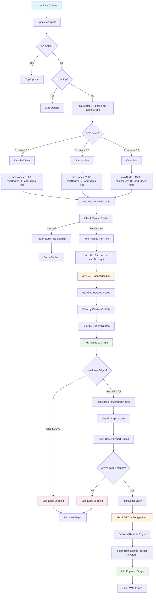

```mermaid
graph TD
    A[User Pans/Zooms] --> B[updateViewport]
    B --> C{isDragging?}
    C -->|Yes| D[Skip Update]
    C -->|No| E{isLoading?}
    E -->|Yes| F[Skip Update]
    E -->|No| G[calculateLOD based on camera.ratio]
    
    G --> H{LOD Level?}
    H -->|0: ratio < 0.5| I[Detailed View]
    H -->|1: ratio < 3.0| J[Normal View]
    H -->|2: ratio >= 3.0| K[Overview]
    
    I --> L[maxNodes: 1000, minDegree: 1, loadEdges: true]
    J --> M[maxNodes: 2500, minDegree: 2, loadEdges: true]
    K --> N[maxNodes: 1500, minDegree: 10, loadEdges: false]
    
    L --> O[loadViewportNodesLOD]
    M --> O
    N --> O
    
    O --> P[Check Spatial Cache]
    P -->|Cached| Q[Return Early - No Loading]
    P -->|Not Cached| R[Fetch Nodes from API]
    
    R --> S[fetchBoxBatched or fetchBoxLight]
    S --> T[API: GET /api/nodes/box]
    T --> U[Backend Returns Nodes]
    U --> V[Filter by Cluster Visibility]
    V --> W[Filter by Quality/Degree]
    W --> X[Add Nodes to Graph]
    
    X --> Y{shouldLoadEdges?}
    Y -->|false LOD=2| Z[Skip Edge Loading]
    Y -->|true LOD=0,1| AA[loadEdgesForViewportNodes]
    
    AA --> BB[Get All Graph Nodes]
    BB --> CC[Filter: Only Viewport Nodes]
    CC --> DD{Any Viewport Nodes?}
    DD -->|No| EE[Skip Edge Loading]
    DD -->|Yes| FF[fetchEdgesBatch]
    
    FF --> GG[API: POST /api/edges/batch]
    GG --> HH[Backend Returns Edges]
    HH --> II[Filter: Both Source+Target in Graph]
    II --> JJ[Add Edges to Graph]
    
    Z --> KK[End - No Edges]
    EE --> KK
    JJ --> LL[End - With Edges]
    Q --> MM[End - Cached]
    
    style A fill:#e1f5fe
    style T fill:#fff3e0
    style GG fill:#fff3e0
    style X fill:#e8f5e8
    style JJ fill:#e8f5e8
    style Z fill:#ffebee
    style EE fill:#ffebee
```
